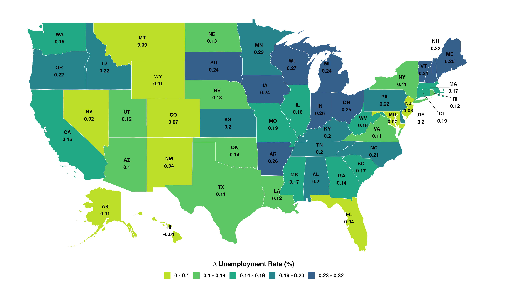

## Working Papers

[**Labor Market Responses to Trade: Job Creation and Destruction Across Space and Sectors**](jmp.pdf)  

  

    
 Abstract 

    In an era dominated by globalization and international trade, the impact of trade shocks on employment has become a pressing concern for policymakers and the public. This paper examines the impact of the China trade shock on U.S. local labor markets, focusing on unemployment and its key drivers: job finding and job separation rates. Using a shift-share design, I find that regions exposed to the shock experience significant and persistent unemployment increases due to lower job finding and higher job separation rates. To explain these results, I develop a dynamic multi-sector, multi-region labor matching model with endogenous job creation and destruction. The calibrated model confirms that trade shocks raise unemployment, decrease employment, and increase welfare inequality across most U.S. states. The China trade shock raises the U.S. unemployment rate by 0.18% and accounts for 87% of the decline in the manufacturing employment share of working-age population from 2000 to 2007, while boosting overall productivity by 0.16% and improving welfare by 0.04%. The model shows that the Hosios condition alone cannot achieve constrained efficiency due to migration frictions and nontradable goods. A redistributive corporate tax policy subsidizing manufacturing could improve welfare, reduce unemployment, and restore pre-shock manufacturing employment levels.
    <!-- Insert the figure here using the  tag -->
     
  

  
  <iframe src="interactive_map.html" style="border:none;" width="100%" height="500px"></iframe>

---

## Work in Progress

**A Multi-country Real Business Cycle Model of International Trade and Finance**  
with Tianyang Xie Chenyanzi Yu

---
